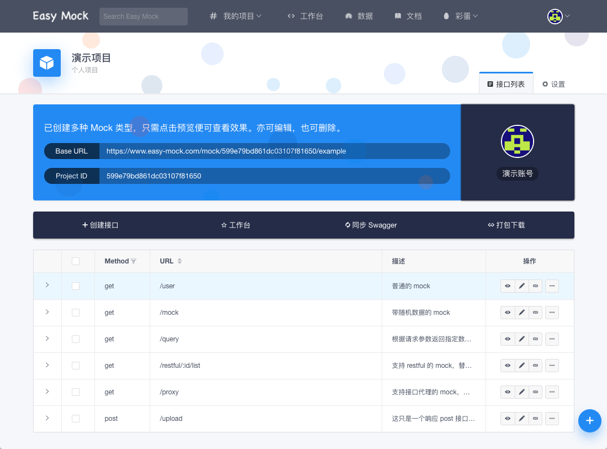
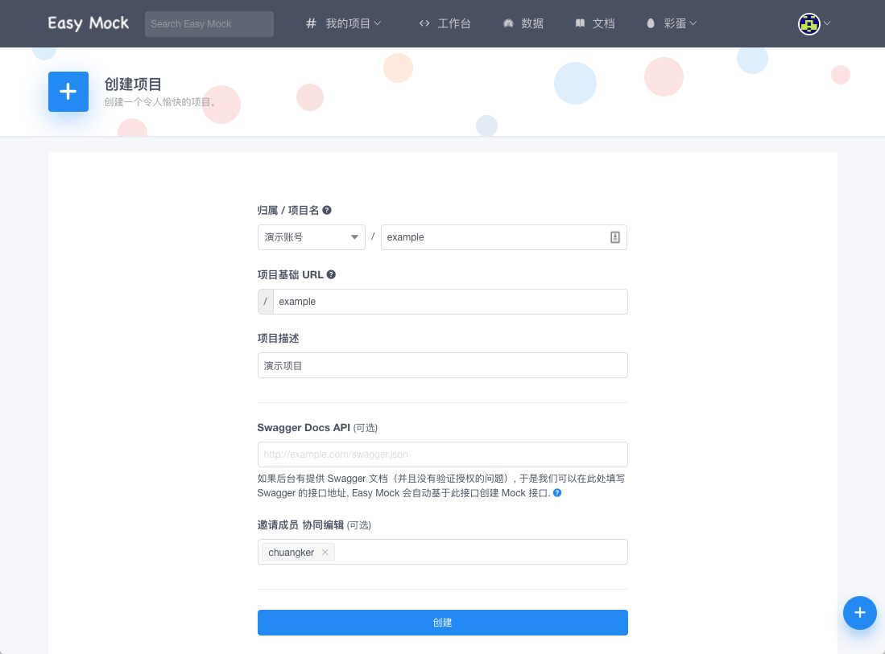
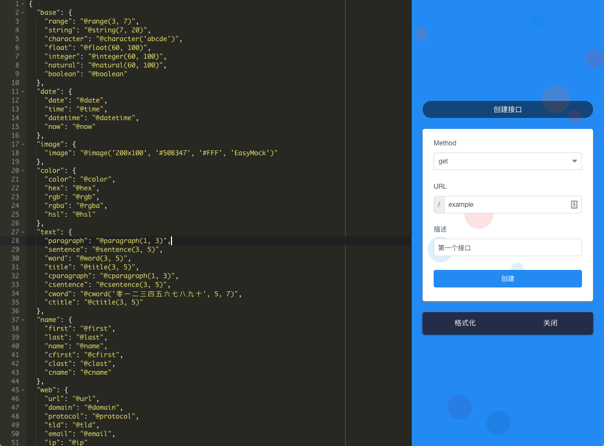
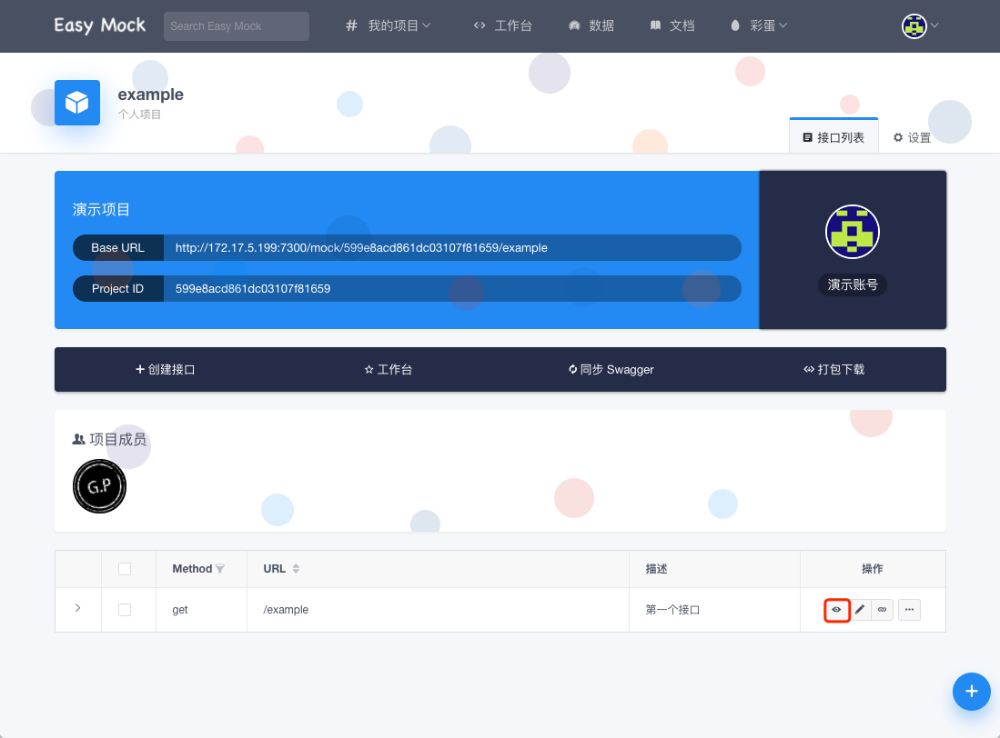
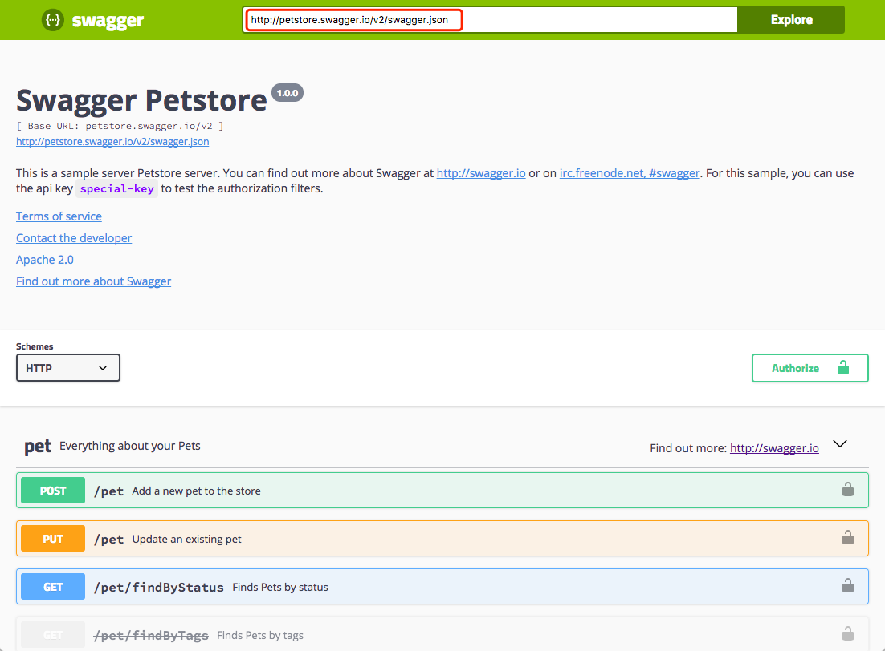
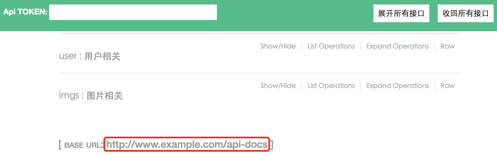
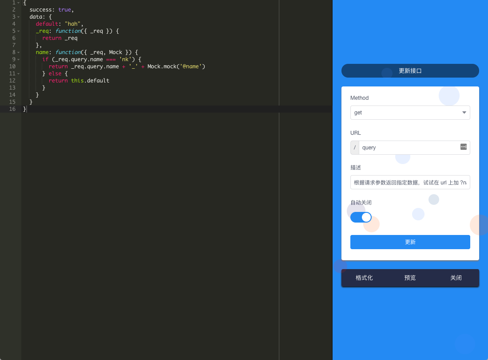

# Easy Mock
Easy Mock 是一个可视化，并且能快速生成 **模拟数据** 的持久化服务。
忘掉下面这些实用但麻烦的 Mock 方式吧。在你用了 Easy Mock 之后，你肯定会爱不释手的。另外，如果使用时让你不快乐，那么请一定要记得 [反馈](#fan-kui)。

**常见的 Mock 方式：**
- 将模拟数据直接写在代码里
- 利用 JavaScript 拦截请求
- 利用 Charles、 Fiddler 等代理工具拦截请求

## 快速开始
### 演示项目
> 每个接口旁都有一个小箭头，点击之后会展开并显示该接口的详细信息。

所有 **新注册** 的用户都会为其创建一个演示项目，如下图所示。这个项目中已经创建了大部分场景下的演示接口，点击接口旁的 **预览按钮** 即可。如果你已经掌握了 Easy Mock 的使用，可以将其删除。



### 基础语法
> Easy Mock 引入了 [Mock.js](http://mockjs.com)，下面只提供部分语法展示。更详尽的用例及文档请参考 Mock.js 官网。
> - 支持生成随机的文本、数字、布尔值、日期、邮箱、链接、图片、颜色等
> - 支持扩展更多数据类型，支持自定义函数和正则


```js
{
  "string|1-10": "★",
  "string2|3": "★★",
  "number|+1": 202,
  "number2|1-100.1-10": 1,
  "boolean|1": true,
  "regexp": /[a-z][A-Z][0-9]/,
  "absolutePath": "@/string @/user/name",
  "user": {
    "name": "demo"
  },
  "object|2": {
    "310000": "上海市",
    "320000": "江苏省"
  },
  "array|1": [ "AMD" ]
}
```

上面只展示了最基本的语法，如果你不明白为何要这样定义？请阅读 Mock.js 文档。
下面是生成的随机数据，会随请求发生改变。

```js
{
  "string": "★",
  "string2": "★★★★★★",
  "number": 202,
  "number2": 71.73566,
  "boolean": false,
  "regexp": "qS8",
  "absolutePath": "★ demo",
  "user": {
    "name": "demo"
  },
  "object": {
    "310000": "上海市",
    "320000": "江苏省"
  },
  "array": "AMD"
}
```

### 数据占位符

掌握 **数据占位符** 可以让你的随机数据更真实。

```js
{
  "string|1-2": "@string",
  "integer": "@integer(10, 30)",
  "float": "@float(60, 100, 2, 2)",
  "boolean": "@boolean",
  "date": "@date(yyyy-MM-dd)",
  "datetime": "@datetime",
  "now": "@now",
  "url": "@url",
  "email": "@email",
  "region": "@region",
  "city": "@city",
  "province": "@province",
  "county": "@county",
  "upper": "@upper(@title)",
  "guid": "@guid",
  "id": "@id",
  "image": "@image(200x200)",
  "title": "@title",
  "cparagraph": "@cparagraph",
  "csentence": "@csentence",
  "range": "@range(2, 10)"
}
```

上面只展示了些基本的占位符，如果你想了解更多？请阅读 Mock.js 文档。
下面是生成的随机数据，会随请求发生改变。

```js
{
  "string": "&b(V",
  "integer": 29,
  "float": 65.93,
  "boolean": true,
  "date": "2013-02-05",
  "datetime": "1983-09-13 16:25:29",
  "now": "2017-08-12 01:16:03",
  "url": "cid://vqdwk.nc/iqffqrjzqa",
  "email": "u.ianef@hcmc.bv",
  "region": "华南",
  "city": "通化市",
  "province": "陕西省",
  "county": "嵊州市",
  "upper": "DGWVCCRR TLGZN XSFVHZPF TUJ",
  "guid": "c09c7F2b-0AEF-B2E8-74ba-E1efC0FecEeA",
  "id": "650000201405028485",
  "image": "http://dummyimage.com/200x200",
  "title": "Orjac Kwovfiq Axtwjlop Xoggxbxbw",
  "cparagraph": "他明林决每别精与界受部因第方。习压直型示多性子主求求际后世。严比加指安思研计被来交达技天段光。全千设步影身据当条查需府有志。斗中维位转展新斯克何类及拉件科引解。主料内被生今法听或见京情准调就品。同六通目自观照干意音期根几形。",
  "csentence": "命己结最方心人车据称温增划眼难。",
  "range": [2, 3, 4, 5, 6, 7, 8, 9]
}
```

### 创建一个项目

现在我们要开始创建第一个项目了，准备好了吗？

**第一步：点击蓝色按钮**
> 不管你在哪个页面？这个蓝色按钮都会固定在那。

| 参数 | 描述 | 
|:---:|:----:|
| 归属 | 如果你是创建团队项目，一定要记得选团队 |
| 项目基础 URL | 没有特殊要求，尽量简短表意。例：/nba |
| Swagger Docs API | 如果有，详见 [Swagger](#swagger) 一节 |



**第二步：点击进入刚刚创建的项目**
**第三步：点击创建接口**
> 关于 em.demo.all ，详见 [语法提示](#yu-fa-ti-shi) 一节。

在数据编辑器中，输入 **em.demo.all** 按下回车，神奇的事情发生了。已经基于 Mock.js 语法自动创建好了数据对象，点击创建完成最后一步吧！



**最后一步：预览接口**

每个接口旁边都会对应很多操作按钮。现在点击红框标注的 **预览按钮**，看看会发生什么事情吧！



## 进阶指南

如果你已经掌握了上面基础部分，那么进阶指南将会使你把 Easy Mock 用到极致。

### 善用工作台

一旦项目变多，并且要在各个项目中来回切换的时候，请一定要记得使用工作台。虽然搜索也能解决问题，但还是有很多多余的步骤。更快捷的方式就是点击项目上的 **小星星**，将其加入到工作台中。一旦项目结束记得用 **同样的方式** 将项目移除工作台。

### Swagger
> 如果你还不知道 [Swagger](http://swagger.io) 是什么？

效率一直我们关注的问题。Easy Mock 支持基于 Swagger 创建项目，以节省手动创建接口的时间。Swagger 文档更新也能通过更新操作重新生成接口，并且这是智能的，只会对修改过的接口进行更新。

**基于 Swagger 创建的项目，会有以下几种能力。**

- 创建时会匹配状态为 `200` 的响应数据，生成相应的 Class Model，这样可以节省我们创建实体类的时间。
- 支持查看 `请求参数` 和 `响应参数`（前提是 Swagger 文档有定义这些字段）。

**获取 Swagger Docs API**
> 进入 **文档首页** 获取文档接口地址

下面以 Swagger 官方演示项目 [Petstore](http://petstore.swagger.io/#/api-docs) 为例。如图所示，红框标注部分就是文档的接口地址，我们只需要在 `创建项目` 的时候，在 `Swagger Docs API` 一栏填写上即可。



由于版本问题，也许你会看到这样的文档首页。不要紧，复制如下地址即可。



如果不确定接口地址对不对？将地址复制到浏览器上打开，看看内容是否跟以下内容相似（**注意：不同版本，接口内容是不同的，但可以大致判断出**）。

```json
{
  "apiVersion": "1.0",
  "swaggerVersion": "1.2",
  "info": {
    "description": "api list",
    "termsOfServiceUrl": "http://www.example/api-docs",
    "title": "api"
  },
  "apis": [
    {
      "description": "用户相关",
      "path": "/user",
      "position": 0
    },
    {
      "description": "图片相关",
      "path": "imgs",
      "position": 0
    }
  ]
}
```

如果创建项目之后没有接口数据，那么该接口文档可能存在一些问题（例如：数据对象交叉引用）。建议阅读下面的 OpenAPI 规范，再修改文档。{.warning}

**OpenAPI 规范，感兴趣可以了解下**

- [OpenAPI Specification 1.2](https://github.com/OAI/OpenAPI-Specification/blob/master/versions/1.2.md)
- [OpenAPI Specification 2.0](https://github.com/OAI/OpenAPI-Specification/blob/master/versions/2.0.md)
- [OpenAPI Specification 3.0](https://github.com/OAI/OpenAPI-Specification/blob/master/versions/3.0.0.md)

### API 自动生成

如果你想进一步提高自己的效率，现在可以通过 [Easy Mock CLI](https://github.com/easy-mock/easy-mock-cli) 自动创建诸如 `api.js` 这样的文件了。

### 响应式数据
> 虽然无法做到数据联动，但是借助于 **响应式数据**，也能玩出许多新花样。

我们可以在 **数据编辑器** 中，为某个属性指定一个 **Function**。在 Function 中，我们提供了 **_req** 对象，这使得我们可以通过请求对象编写逻辑，实现响应式数据，如图所示。



当我们请求这个接口时，数据返回如下。如果我们传入的 `name` 为 `nk`，那么 `name` 将会随机变化。

```js
{
  "success": true,
  "data": {
    "default": "hah",
    "_req": {
      "method": "GET",
      "url": "/mock/599e9e962f17da111139eaf9/example/query",
      "header": {
        "connection": "keep-alive",
        "accept": "application/json, */*",
        "content-type": "application/json",
        "accept-encoding": "gzip, deflate",
        "accept-language": "zh-CN,zh;q=0.8,en;q=0.6,zh-TW;q=0.4,ja;q=0.2",
        // ...
      }
    },
    "name": "nk_Melissa Hernandez"
  }
}
```
**Function 参数说明**

| 对象 | 描述 | 
|:---:|:----:|
| Mock | Mock 对象 |
| _req.url | 获得请求 url 地址 |
| _req.method | 获取请求方法 |
| _req.params | 获取 url 参数对象|
| _req.querystring | 获取查询参数字符串(url中?后面的部分)，不包含 ? |
| _req.query | 将查询参数字符串进行解析并以对象的形式返回，如果没有查询参数字字符串则返回一个空对象 |
| _req.body | 当 post 请求以 `x-www-form-urlencoded` 方式提交时，我们可以拿到请求的参数对象 |
| _req.path | 获取请求路径名 |
| _req.header | 获取请求头对象 |
| _req.originalUrl | 获取请求原始地址 |
| _req.search | 获取查询参数字符串，包含 ? |
| _req.host | 获取 host (hostname:port) |
| _req.hostname | 获取 hostname |
| _req.type | 获取请求 Content-Type，不包含像 "charset" 这样的参数 |
| _req.protocol | 返回请求协议 |
| _req.ip | 请求远程地址 |
| _req.get(field) | 获取请求 header 中对应 field 的值 |
| _req.cookies(field) | 获取请求 cookies 中对应 field 的值 |

### 响应式数据注意事项
> 响应式数据提高了数据的可扩展性和灵活性，但同时也带来了一些问题。例如：代码中出现了死循环，这些问题往往都是致命的，因此我们做了一些限制。

如果生成数据的时间 **超过1s**，系统将会返回一个 **timed out** 的错误信息，此时应该检查代码是否出现了 **异步操作** 或 **死循环**。

另外，无法在函数中使用 **setInterval**、**setTimeout** 等方法进行异步操作。{.warning}

### 自定义响应

当定义的数据结构中包含 _res 字段的时候，会进入一个特殊逻辑，可以给返回的请求添加一些定制信息。

| 字段 | 描述 | 
|:---:|:----:|
| status | 可以定制返回的 http status code，默认是 200 |
| cookies | 可以定制需要设置的 cookie（暂时不支持设置过期时间等） |
| headers | 可以定制返回的 response 的 header |
| data | 如果有这个字段，会以此数据直接覆盖整个返回的数据，并且此处不支持 mock 的语法（如果 _res.status 的值为 200，则不会覆盖默认定义的 mock 数据） |

```js
{
  "success": true,
  "data": {
    "default": "hah"
  },
  "_res":{
    "status": 400,
    "data": {
      "success": false
    },
    "cookies": {
      "test": "true"
    },
    "headers": {
      "Power": "easy-mock"
    }
  }
}
```

以此定义为例，当 _res.status 的值为 400 的时候，用户端接收到的响应将会是 _res.data 中定义的数据，并且返回一个 status code 为 400 的响应，响应的 header 中会包含一个叫做 Power 的值，并为浏览器设置一个叫做 test 的 cookie。

当你想要返回正常的 mock 数据的时候，修改 _res.status 为 200，或者将整个 _res 删掉即可。


## Tips

掌握这部分内容，可进一步提高效率。

### 快捷键
> 目前 Safari 不支持。

现在试试键盘按下 `shift` + `?`，不出意外会出现一个快捷键提示框，如果没有可以切换下输入法试试。左侧的快捷键是全局的，不同页面有不同的快捷键，自己去其它页面试试吧。

### 语法提示

现在数据编辑器支持 **语法提示** 了。如果你想获得关于 Mock.js 的语法提示，可以输入 **em.** 即可。
按照 Mock.js 的分类，分为：

- em.base
- em.date
- em.image
- em.color
- em.text
- em.name
- em.web
- em.address
- em.helper
- em.miscellaneous
- em.demo.all

数据编辑器支持按下 `shift` + `f` 搜索哦！{.tip}

### 批量操作

目前，**接口删除**、**接口下载** 支持批量操作。只需在接口旁边勾选上，执行相应操作即可。

### 移动端调试

步骤：

- 利用 Charles Fiddler 等代理工具，抓取客户端中包含页面入口的接口
- 在 Easy Mock 上创建一个接口
- 将刚刚抓取的接口数据复制到 `数据编辑器` 中，修改页面入口为本地的入口然后保存。要用本地 `ip` 哦，`localhost` 在手机上是无效的
- 复制接口地址
- 回到代理工具，点击最开始抓取的接口，将其代理成刚刚复制的地址即可

## 特性
### 接口代理

不难发现 **演示项目** 下有一个地址为 `/proxy` 的接口。在数据编辑器中我们只填写了一个接口地址，预览的时候可以把这个接口的数据代理回来。除此之外，我们向 `/proxy` 传入的参数（query 和 body）都会被传递过去。
**并且**，如果你的代理接口地址为 `http://example.com/api/user/:id`，mock 接口地址为 `/api/user/:id`，那么这个 `id` 也会被正确的解析出来。

注意：接口代理的超时时间为 **3s**。 {.warning}

### JSONP

为了满足更多的使用场景，Easy Mock 支持 JSONP。不管是什么接口，只需要在请求中加入 **jsonp_param_name** 参数即可。
一般情况下，`JSONP` 的参数名多为 `callback`。但为了满足更多情况，我们通过 **jsonp_param_name** 参数去指定这个参数名。

```js
// .../account/updSex?jsonp_param_name=callback&callback=success
```

### 协同编辑
> 如果是多人开发，那么你可以邀请小伙伴一起编辑 Mock。

项目中的成员，皆能 `邀请` 或 `移除` 成员。作为被邀请者如果想移除项目，可在编辑项目时将自己移除，保存即可。另外，只有创建者才能删除项目哦！

### 团队项目
> 为了满足更多场景，Easy Mock 支持团队项目。

- **所有用户** 都可以创建、加入团队，并且 **没有条件限制**
- **所有用户** 都可以在团队下创建、修改项目，但无法删除项目 **只有创建者能删除**
- 虽然个人项目也能通过邀请的方式达到同样的目的，但这种方式会更适合团队协作
- 因为第一条的原因，建议在创建团队时，将团队名取特殊一点

### Restful

如果后端提供 `/restful/:id/list` 这样或者这样 `/restful/{id}/list` 的接口地址。别慌，Easy Mock 是支持的。

## 常见问题
### 忘记密码

如果你忘记了密码？那么很遗憾的告诉你，目前没有提供找回密码的通道，建议重新创建一个账号。

### 如何本地部署

本地部署的相关介绍，请移步 [GitHub](https://github.com/easy-mock/easy-mock)。

### 数据如何联动

无法进行数据联动，但是可以根据 [响应式数据](#xiang-ying-shi-shu-ju) 实现一些需求。

### 响应式数据返回异常

如果使用了响应式数据，并且接口返回异常，请先根据 **message** 的描述 **检查数据模型** 中可能存在的 **语法错误**。

请确保你已经了解了 [响应式数据注意事项](#xiang-ying-shi-shu-ju-zhu-yi-shi-xiang)。 {.warning}

### 加入团队不用审核吗

起初为了使用方便，并没有涉及到这块的支持。所以建议大家在创建团队的时候可以将团队名称取 **特殊** 且 **长一点**。

### 如何定义参数/响应状态

目前只有基于 Swagger 创建的项目才会自动创建相关的参数和响应数据定义，无法进行手动添加。

### 没有 Swagger 文档

Easy Mock 并没有强制要求使用 Swagger，所以即使没有 Swagger 我们也能愉快的使用 Easy Mock。如果你真的很想体验用 Swagger 创建项目，那么可以到 [Swagger Editor](http://editor.swagger.io) 上写接口文档，然后生成 JSON，再使用 **内网 Swagger 文档** 的解决方案即可。

### 内网 Swagger 文档

如果 Swagger 文档只能内网访问，那么外网 Easy Mock 将无法为其创建项目。

**解决方案**
> 不适用于 OAS 1.2

- 复制文档接口的 JSON 数据，以 [Petstore](http://petstore.swagger.io/v2/swagger.json) 为例
- 在 Easy Mock 中新建一个接口，`数据编辑器` 中粘贴刚刚复制的接口数据（可能有点大）并完成创建
- 复制刚刚创建的接口的 URL
- 创建一个新的项目，`Swagger Docs API` 文本框填写刚刚复制的 URL
- 填写完其它内容点击创建即可

## 其它
### 反馈

扫描以下二维码，有任何问题可以在群内反馈。

 {.qq-qun}
